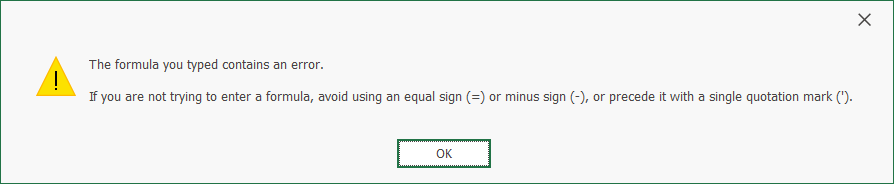

# Spreadsheet - How to use the CONCATENATE function to update formulas with text values longer than 255 characters

Text values in spreadsheet formulas are limited to 255 characters. If you load a document that contains formulas with string arguments longer than 255 characters, the Spreadsheet control truncates extra characters in these formulas. To avoid this behavior and allow formulas with long strings, set the **SpreadsheetCompatibilityOptions.TruncateLongStringsInFormulas** property to **false**.

Consider the following restrictions if you disable this option:

* The following message appears when a user edits a formula with text values longer than 255 characters:

    

* Long strings in formulas are truncated to 255 characters when you export the document to Excel formats. 

We recommend that you use the CONCATENATE function or the concatenation operator (&) to create formulas with string arguments longer than 255 characters. This example demonstrates how to implement **ReplaceLongStringsWalker** that iterates through all formulas in a workbook and splits long strings in formulas with the CONCATENATE function.

<!-- default file list -->
*Files to look at*:

* [Form1.cs](./CS/SpreadsheetApp/Form1.cs)
* [ReplaceLongStringsWalker.cs](./CS/SpreadsheetApp/ReplaceLongStringsWalker.cs)
<!-- default file list end -->